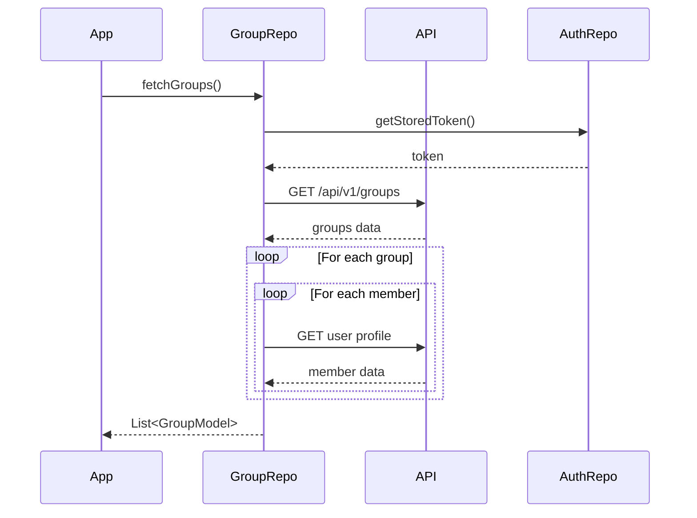
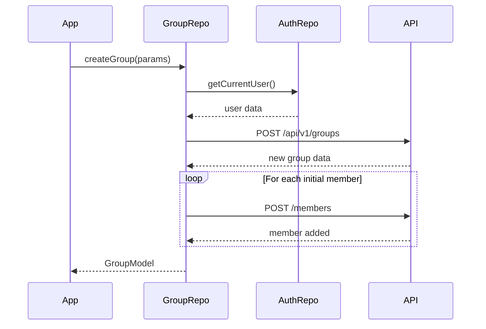
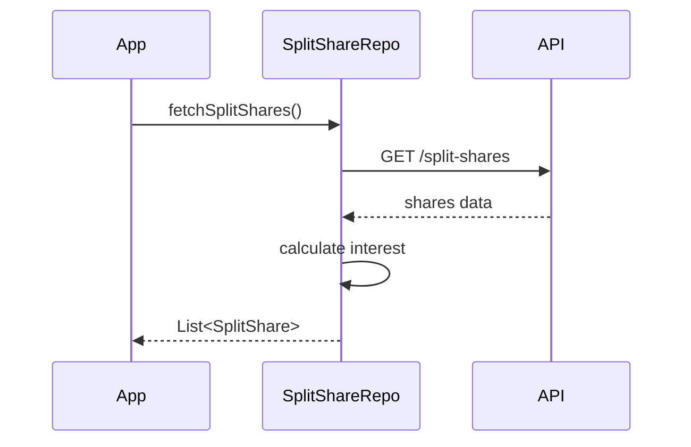

# FinGenie Repository Documentation

## Authentication Repository
The Authentication Repository is the central component for managing user authentication, session handling, and local user data persistence.

### Function Breakdown

#### `Future<void> _storeToken(String token)`
This function securely stores the authentication token using SharedPreferences. The token is used for all authenticated API requests. If token storage fails, it logs the error but doesn't throw an exception to prevent app crashes.

#### `Future<String?> getStoredToken()`
Retrieves the stored authentication token from SharedPreferences. Returns null if no token is found or if an error occurs during retrieval. This function is crucial for maintaining user sessions and is called before making any authenticated API requests.

#### `static Future<void> init()`
Initializes the authentication repository by:
1. Registering the UserModel adapter with Hive if not already registered
2. Closing any open user box to prevent memory leaks
3. Opening a new user box for data storage
4. Debugging the initialization state and box contents

Usage Example:
```dart
await AuthRepository.init();
// Repository is now ready for use
```

#### `Future<UserModel> signUp(SignUpRequest request)`
Handles the complete user registration process:
1. Makes API request to `/api/v1/auth/signup` with user data
2. Processes the response to extract token and user information
3. Creates a new UserModel instance
4. Stores the authentication token
5. Saves user data to local Hive storage

Error Handling:
- Email already exists (409)
- Invalid input data (400)
- Network errors
- Storage errors

Usage Example:
```dart
final signUpRequest = SignUpRequest(
  email: 'user@example.com',
  password: 'securePassword',
  name: 'John Doe',
  phoneNumber: '+1234567890'
);

try {
  final user = await authRepository.signUp(signUpRequest);
  // Handle successful signup
} catch (e) {
  // Handle error based on exception type
}
```

#### `Future<UserModel> login(LoginRequest request)`
Manages user authentication:
1. Sends credentials to `/api/v1/auth/login`
2. Processes authentication response
3. Creates and stores UserModel
4. Manages token storage
5. Updates local user data

Error Handling:
- Invalid credentials (401)
- Invalid input (400)
- Network issues
- Storage failures

Usage Example:
```dart
final loginRequest = LoginRequest(
  email: 'user@example.com',
  password: 'password123'
);

try {
  final user = await authRepository.login(loginRequest);
  // Proceed with logged in user
} catch (e) {
  // Handle login failure
}
```

#### `Future<void> logout()`
Handles user session termination:
1. Removes stored user data from Hive
2. Clears authentication token
3. Resets user state

#### `UserModel? getCurrentUser()`
Retrieves the currently logged-in user from local storage:
1. Opens user box if not already open
2. Returns stored user data or null if no user is found

#### `Future<void> verifyUserPersistence()`
Debug function to verify user data persistence:
1. Checks if user data exists in storage
2. Logs user details for verification
3. Reports any persistence issues

#### `Future<UserModel?> updateProfileLocally()`
Updates user profile information in local storage:
1. Updates currency preferences
2. Updates demographic information
3. Updates financial information
4. Persists changes to Hive storage

## Group Repository
The Group Repository manages all group-related operations including creation, member management, and data synchronization.

### Function Breakdown

#### `Future<List<GroupModel>> fetchGroups()`
Retrieves all groups associated with the current user:
1. Fetches groups from `/api/v1/groups`
2. Processes member data for each group
3. Fetches user profiles for all group members
4. Constructs complete group models with member information



Usage Example:
```dart
try {
  final groups = await groupRepository.fetchGroups();
  // Process retrieved groups
} catch (e) {
  // Handle fetch error
}
```

#### `Future<void> addGroupMembers()`
Adds new members to an existing group:
1. Validates member IDs
2. Makes individual requests for each member
3. Handles partial success scenarios
4. Updates group member list

Error Handling:
- Invalid member IDs
- Permission issues
- Network failures
- Partial success handling

Usage Example:
```dart
try {
  await groupRepository.addGroupMembers(
    groupId: 'group123',
    memberIds: ['user1', 'user2']
  );
  // Members added successfully
} catch (e) {
  // Handle member addition failure
}
```

#### `Future<String> findUserByPhone(String phoneNumber)`
Searches for a user by phone number:
1. Makes API request to user search endpoint
2. Processes response to extract user ID
3. Handles user not found scenarios

Usage Example:
```dart
try {
  final userId = await groupRepository.findUserByPhone('+1234567890');
  // Use found user ID
} catch (e) {
  // Handle user not found
}
```

#### `Future<GroupModel> createGroup()`
Creates a new group with specified parameters:
1. Validates input parameters
2. Sets up default values based on user preferences
3. Creates group on server
4. Processes response and creates local group model
5. Handles member addition if initial members provided

Error Handling:
- Input validation
- Server errors
- Member addition failures
- Currency validation



Usage Example:
```dart
try {
  final group = await groupRepository.createGroup(
    name: 'Weekend Trip',
    tag: 'trip',
    securityDepositRequired: true,
    securityDeposit: 1000.0,
    autoSettlement: true,
    initialMembers: ['user1', 'user2']
  );
  // Handle successful group creation
} catch (e) {
  // Handle creation failure
}
```

#### `Future<Map<String, dynamic>> getUserProfileById(String userId)`
Retrieves detailed user profile information:
1. Makes authenticated request to profile endpoint
2. Processes user data
3. Returns formatted user profile

#### `Future<GroupModel> getGroupDetails(String groupId)`
Fetches comprehensive group information:
1. Retrieves basic group data
2. Fetches all member profiles
3. Constructs complete group model with member details
4. Handles missing member data gracefully

## Split Share Repository
The Split Share Repository manages expense sharing calculations and settlements.

### Function Breakdown

#### `Future<List<SplitShare>> fetchSplitShares()`
Retrieves all split shares for the current user:
1. Fetches shares from API
2. Processes payment statuses
3. Calculates interest if applicable
4. Returns formatted share list



Usage Example:
```dart
try {
  final shares = await splitShareRepository.fetchSplitShares();
  // Process split shares
} catch (e) {
  // Handle fetch error
}
```

## Testing Repositories

### Auth Repository Testing
```dart
void main() {
  late AuthRepository authRepository;
  late MockDio mockDio;
  
  setUp(() {
    mockDio = MockDio();
    authRepository = AuthRepository(dio: mockDio);
  });
  
  test('login success returns user model', () async {
    // Test implementation
  });
  
  test('signup handles email exists error', () async {
    // Test implementation
  });
}
```

### Group Repository Testing
```dart
void main() {
  late GroupRepository groupRepository;
  late MockDio mockDio;
  
  setUp(() {
    mockDio = MockDio();
    groupRepository = GroupRepository(
      dio: mockDio,
      apiUrl: 'test-api-url'
    );
  });
  
  test('fetchGroups returns list of groups', () async {
    // Test implementation
  });
  
  test('createGroup handles validation errors', () async {
    // Test implementation
  });
}
```

## Best Practices

### Error Handling
1. Always use try-catch blocks
2. Log errors using AppLogger
3. Return meaningful error messages
4. Handle network timeouts
5. Implement retry logic for critical operations

### Data Persistence
1. Use transactions for related operations
2. Implement data validation
3. Handle storage quota exceeded
4. Implement data migration strategies
5. Regular cleanup of outdated data

### Authentication
1. Implement token refresh
2. Secure token storage
3. Handle session expiration
4. Implement biometric authentication
5. Regular security audits

### Performance
1. Implement caching strategies
2. Use batch operations where possible
3. Optimize network requests
4. Implement pagination
5. Regular performance monitoring
